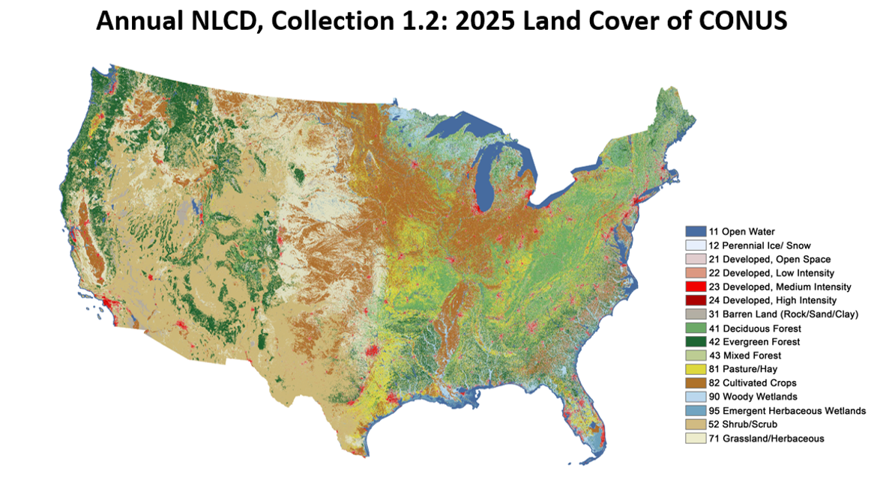
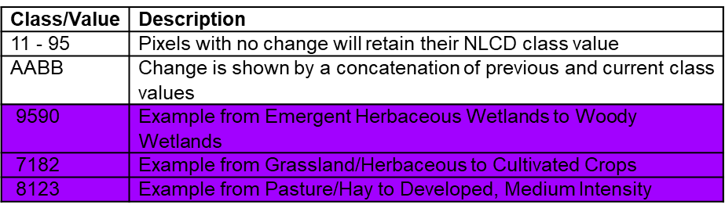
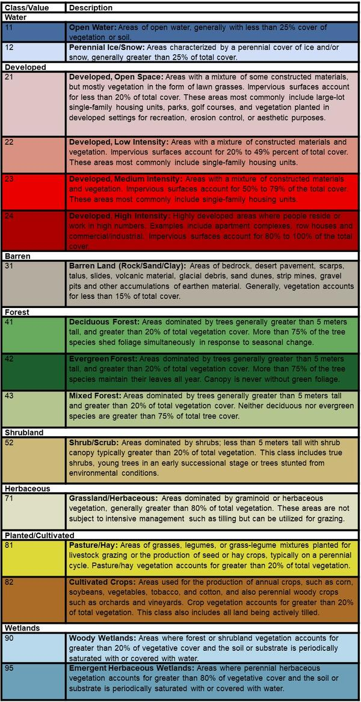

# BBS_landcover

Compute the proportion of land-cover types within 1 km of North American
Breeding Bird Survey (BBS) routes, using the annual
[NLCD](https://www.usgs.gov/centers/eros/science/national-land-cover-database)
land-cover product.

The workflow matches BBS route point records to the official BBS route line
geometries, buffers each line by 1 km, tabulates NLCD pixels inside each
buffer per year, and finally summarises the proportion of a chosen land-cover
category per route per year.



## Pipeline

Run the scripts in `code/` in order. Each one consumes the output of the
previous step.

| Step | Script | Purpose |
|------|--------|---------|
| 1 | `1_prepare_routes.R` | Match BBS route points to route lines (3-step funnel) and build 1-km buffers |
| 2 | `2_prepare_nlcd.R` | Tabulate NLCD pixel frequencies inside each buffer, per year |
| 3 | `3_calculate_nlcd.R` | Compute the proportion of a target land-cover category per route/year |

`code/functions/pre_processing.R` holds helper functions that build the file
paths to the NLCD rasters.

`code/support/` holds diagnostic scripts that are not part of the numbered
pipeline but operate on its outputs:

- `4_check_collinearity.R` — checks collinearity between two land-cover
  proportion outputs from Step 3 (see [below](#support-script--4_check_collinearityr)).

### Step 1 — `1_prepare_routes.R`
Matches each route point to a route line using a 3-step funnel; each step only
considers points still unmatched by the previous step.

1. Similar name (Jaro-Winkler ≥ 0.6) **and** within a 1 km buffer.
2. Exact (cleaned) name **and** within 40 km of the closer line endpoint.
3. Nearest line within a 1 km buffer (any name).

Then buffers each matched route line by 1 km (also in EPSG:5070) to produce the
buffers used in Step 2.

- **Input:** `data/BBS_USA_Routes_WGS84/BBS_USA_Routes_WGS84.shp`,
  `data/Routes_2026Release.csv`
- **Output:** `output/result_perfect.csv`, `output/result_samename.csv`,
  `output/result_1km.csv`, `output/result_routes.csv`,
  `output/result_routes/result_routes.shp`, `output/result_failure.csv`,
  `data/buffer_1km/buffer_1km_proj.shp`

Distance/buffer operations use EPSG:5070 (NAD83 / CONUS Albers, equal area),
so the 1 km / 40 km thresholds are measured in true meters. The buffers are
left in EPSG:5070; Step 2 reprojects each buffer to the NLCD raster CRS on the
fly, so no raster is needed in this step.

### Step 2 — `2_prepare_nlcd.R`
For each buffer and each year, reprojects the buffer to the NLCD raster CRS,
crops/masks the raster to the buffer, and records a frequency table of pixel
classes. Supports both Annual NLCD products via the `product` setting near the
top of the script:

```r
product <- "LndCov"   # "LndCov" or "LndChg"
```

- `LndCov` — **Land Cover**: the 16 base NLCD classes (values `11`-`95`; see the
  table in [Step 3](#step-3--3_calculate_nlcdr)).
- `LndChg` — **Land Cover Change**: the same 16 "no change" values, plus AABB
  change codes (a concatenation of the previous class `AA` and current class
  `BB`). The full AABB lookup table is generated automatically from the 16
  base classes, so it never needs to be typed out by hand.

- **Input:** `data/buffer_1km/buffer_1km_proj.shp`, annual NLCD rasters
- **Output:** `output/routes_1km/<year>/<product><year>V<version>_<StateNum>_<Route>.rds`
  (columns: `layer`, `value`, `class`, `count`)

#### Land Cover Change codes (AABB)
The `LndChg` product encodes each pixel as follows:

| Value | Meaning |
|-------|---------|
| `11`-`95` | Pixels with no change retain their NLCD class value |
| `AABB` | Change is shown by a concatenation of the previous (`AA`) and current (`BB`) class values |

Examples:

| Code | Meaning |
|------|---------|
| `9590` | Emergent Herbaceous Wetlands → Woody Wetlands |
| `7182` | Grassland/Herbaceous → Cultivated Crops |
| `8123` | Pasture/Hay → Developed, Medium Intensity |



### Step 3 — `3_calculate_nlcd.R`
Computes, per route and year, the proportion of buffer pixels belonging to a
chosen land-cover category, and writes a single combined CSV.

- **Input:** `data/Routes_2026Release.csv` (filtered to USA `CountryNum == 840`,
  excluding Alaska `StateNum == 3`), the `.rds` tables from Step 2
- **Output:** `output/<target_name>.csv` (e.g. `output/aridlands.csv`)

`3_calculate_nlcd.R` reads `.rds` tables from Step 2, so `product` here must
match whichever product those tables were built from (`LndCov` by default;
switch to `LndChg` only if Step 2 was run with `product <- "LndChg"`):

```r
product <- "LndCov" # "LndCov" or "LndChg"
```

Select the target category by setting a single line near the top of the
script. The pixel values are looked up automatically from the `target_index`
table, so you only provide the name:

```r
target_name <- "aridlands"
```

`target_name` must be one of the labels defined in `target_index`. Built-in
categories (NLCD pixel values):

| `target_name` | `target_values` |
|---------------|-----------------|
| `grasslands` | `c(71)` |
| `developed` | `c(21, 22, 23, 24)` |
| `aridlands` | `c(31, 52)` |
| `forests` | `c(41, 42, 43)` |
| `croplands` | `c(81, 82)` |
| `Anthro` | `c(21, 22, 23, 24, 81, 82)` (developed + croplands) |
| `grasslands to Anthro` | `c(7121, 7122, 7123, 7124, 7181, 7182)` — **LndChg** codes only (Grassland/Herbaceous converted to any Anthro class); requires Step 2's `.rds` tables to have been built with `product <- "LndChg"` |

To add a new category, add a row to the `target_index` table in the script.
If `target_name` is not found in the table, the script stops with an error.

The pixel values above follow the NLCD land-cover legend:



For the `LndChg` AABB codes (like the `grasslands to Anthro` row above), see
the [Land Cover Change codes](#land-cover-change-codes-aabb) table in Step 2.

### Support script — `4_check_collinearity.R`
Checks collinearity between any two of the per-category CSVs produced by
Step 3 (generically referred to as `LndCov1` and `LndCov2` in the script).
Joins the two files on route/year, then reports the Pearson correlation and
variance inflation factor (`1/(1-r^2)`), both overall and broken down by year.

- **Input:** `output/<LndCov1_name>.csv`, `output/<LndCov2_name>.csv`
- **Output:** console summary only (a scatter-plot block is included in the
  script but currently commented out)

Select the two categories to compare by setting two lines near the top of the
script:

```r
LndCov1_name <- "developed"
LndCov2_name <- "grasslands"
```

Either name must match an existing `output/<name>.csv` file written by Step 3
(e.g. any of `developed`, `grasslands`, `aridlands`, `forests`, `croplands`).
As a rule of thumb, `|r| > 0.7` (VIF > ~2) is often flagged as a collinearity
concern.

## Data

- `data/Routes_2026Release.csv` — BBS route records. Columns include
  `CountryNum`, `StateNum`, `Route`, `RouteName`, `Active`, `Latitude`,
  `Longitude`, `Stratum`, `BCR`, `RouteTypeID`, `RouteTypeDetailID`.
- `data/BBS_USA_Routes_WGS84/` — BBS route line shapefile (WGS84).
- `data/Annual_NLCD_<product>_<year>_CU_C1V<version>/` — annual NLCD rasters.
  These are **not** included in the repository; download them and place each
  raster in its own folder, e.g.
  `data/Annual_NLCD_LndCov_2024_CU_C1V1/Annual_NLCD_LndCov_2024_CU_C1V1.tif`.
  Path construction is handled by `input_nlcd_path()` in
  `code/functions/pre_processing.R`.

## Requirements

- R (≥ 4.1 recommended)
- R packages: `here`, `sf`, `terra`, `tidyverse`, `stringi`, `stringr`,
  `stringdist`, `lwgeom`

```r
install.packages(c("here", "sf", "terra", "tidyverse",
                   "stringi", "stringr", "stringdist", "lwgeom"))
```

The project uses [`here`](https://here.r-lib.org/) for path management, so run
the scripts from the project root (or open the project so `here` can locate the
root automatically).
